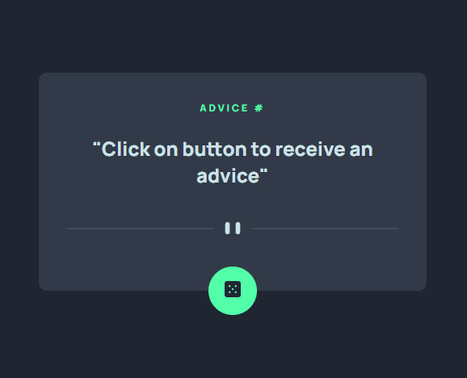

<h3 align="center">
  Preview
</h3>

  

## :rocket: Sobre o desafio

Neste projeto, foi criado uma aplicação para fixar o conteudo aprendido sobre API's e fetch!

App que gera conselhos aleatorios ao clicar no botão

### Funcionalidades da aplicação

- **`Gerar um conselho aleatorio`**: Gera um conselho aleatorio baseado na API adviceslip

### Desafios do projeto

- Realizar consultas em API
- Retonar um resultado da API
- Alterar o HTML com base no resultado da API

Feito por Caio Vinicius Steinbach :bow: :brazil:
